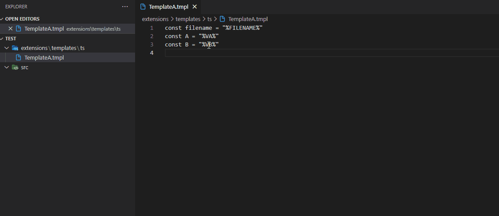
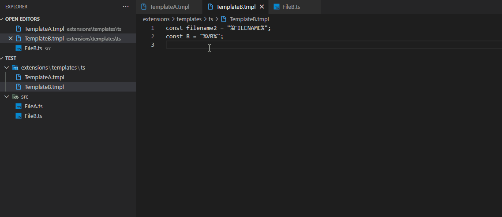

# template-tools

# Setup
1. Create folder in `${WORKSPACE}/extensions/templates/${ext}` (ext is your file extension name, e.g. ts, tsx, js)
2. Create template files and put under your ext folder (e.g. ${WORKSPACE}/extensions/templates/ts/TemplateA.tmpl)

## Template
1. You may name the template file name with any extension name (In general, it can be named as `somename.tmpl`)
2. You can use %FILENAME% use insert the filename
3. Can put variable inside %% like %VARIABLE_A%

# Features
1. Create from template - select a folder and create file from template

2. Insert from template - insert the template in active file

